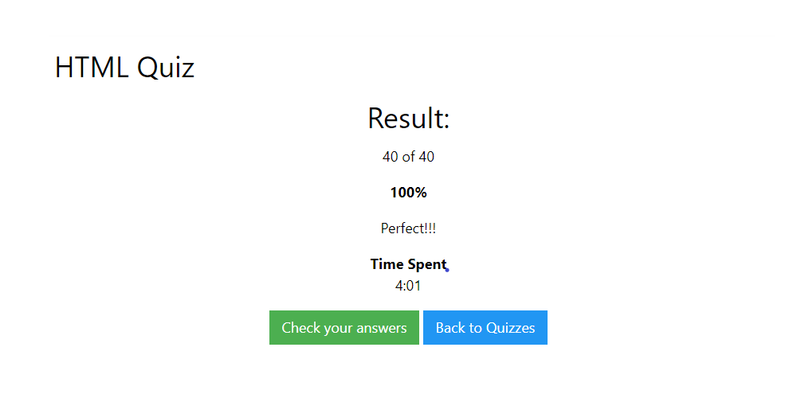

## ¿Qué es HTML?
HTML es un lenguaje de programación que se utiliza para el desarrollo de páginas de Internet. Se trata de la siglas que corresponden a HyperText Markup Language, es decir, Lenguaje de Marcas de Hipertexto.

## Resultado de la prueba
Resultados del Quiz Html de W3school.
