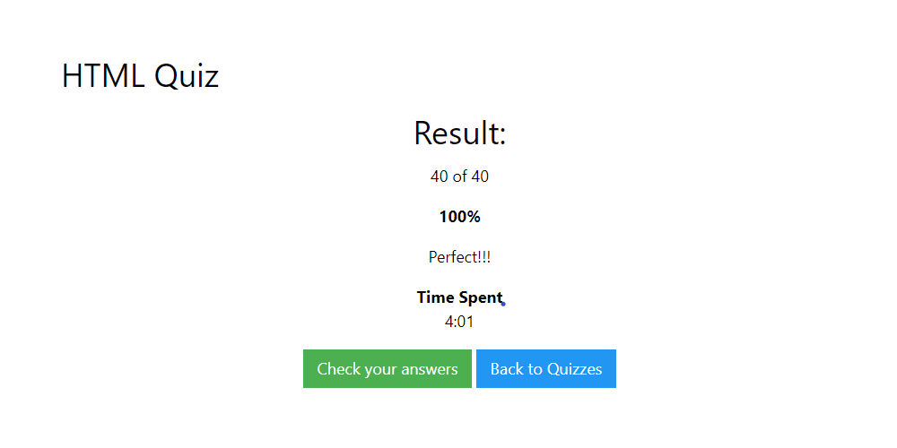

## ¿Qué es JavaScript?
JavaScript es un lenguaje de programación interpretado, dialecto del estándar ECMAScript. Se define como orientado a objetos, ​ basado en prototipos, imperativo, débilmente tipado y dinámico.

## Resultado de la prueba
Resultados del Quiz JavaScript de W3school.
